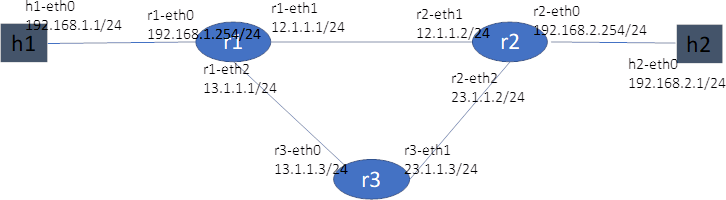
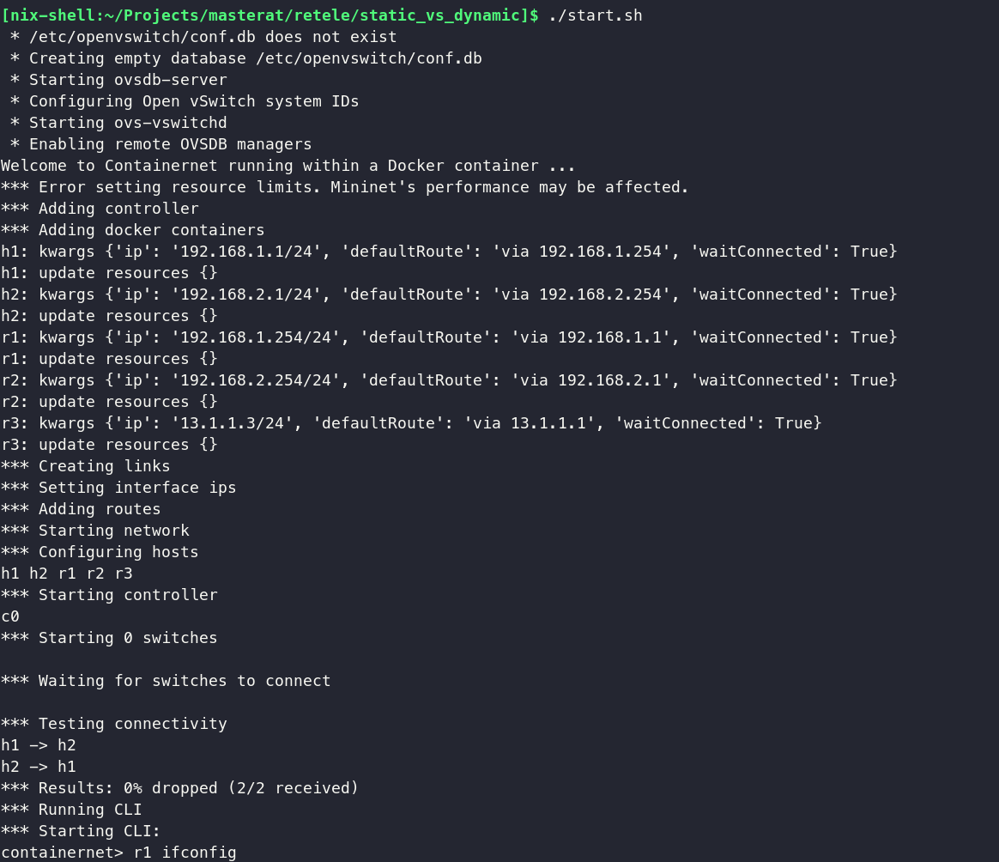
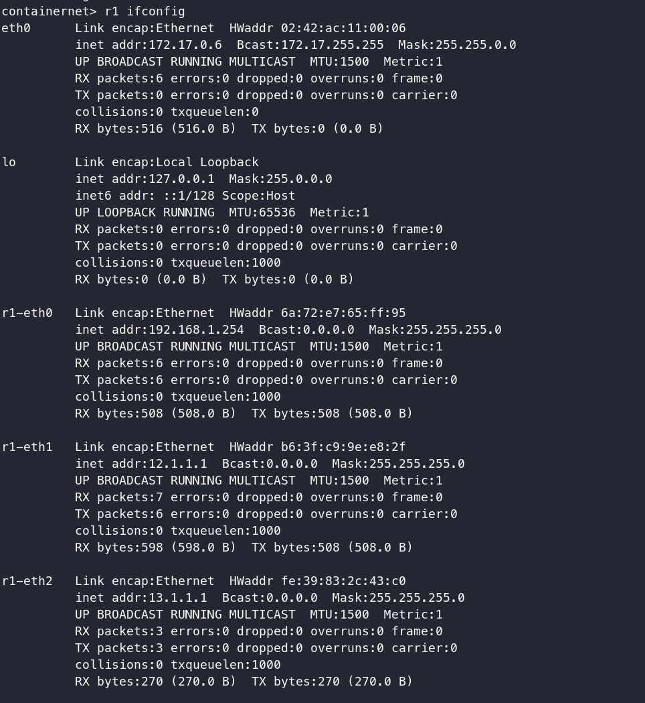
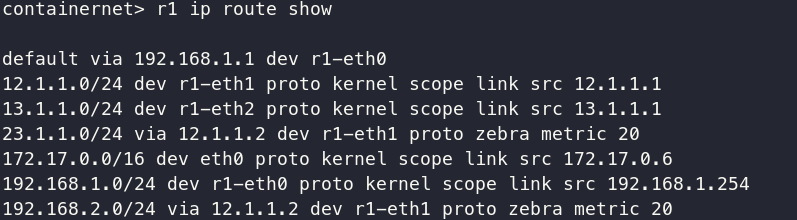
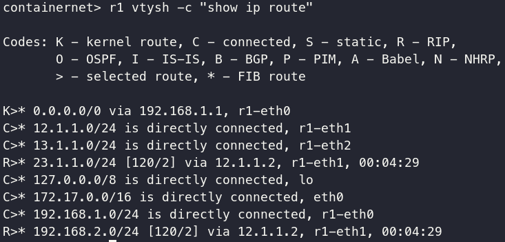

# Containernet

[Containernet](https://containernet.github.io/) is a fork of Mininet that supports Docker containers as hosts. It's great for testing network topologies with real software stacks running inside Docker.

In these particular examples we explore static vs dynamic routing.

## Topology



* Source: [https://nqucsie.myqnapcloud.com/smallko/sdn/routing.htm](https://nqucsie.myqnapcloud.com/smallko/sdn/routing.htm)

## Requirements

1. OvS (Open vSwitch) installed [https://docs.openvswitch.org/en/latest/intro/install/](https://docs.openvswitch.org/en/latest/intro/install/)

2. Docker installed [https://docker.com](https://docker.com)

3. Make sure you have `net.ipv4.ip_forward` enabled on your host:

```
sysctl -w net.ipv4.ip_forward=1
```

## How to run

You can use the wrapper script:

```bash
# to cleanup old networks
./start.sh --clean

# to start static example
./start.sh --static

# to start dynamic example
./start.sh --dynamic

# to force start any example by cleaning old networks
./start.sh --dynamic --clean
```

You can find the source of the scripts in the scripts folder.

## Static routing

Adding routes statically, we are able to ping h2 from h1.





## Dynamic routing

Routing dynamically using Quagga and Rip works by using RIP on the interfaces defined by containernet.



You can also use vtysh in order to connect to quagga from containernet cli.

```
containernet> r1 vtysh
```


